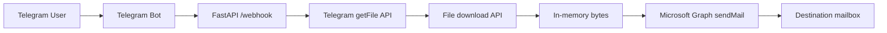

# Condominio Mail Bot

Automation that receives a proof-of-payment document from a Telegram bot and forwards it by email through Microsoft Graph.

The project is intentionally small and focused: Telegram delivers the inbound document, FastAPI exposes the webhook, `httpx` downloads the file directly into memory, and the email service sends the attachment without persisting it to disk.

## Overview

This repository implements a webhook-driven workflow for condominium payment receipts:

1. A user sends a document to a Telegram bot.
2. Telegram sends an update to the FastAPI `/webhook` endpoint.
3. The API validates whether the update contains a PDF document.
4. The Telegram client resolves the file path and downloads the bytes in memory.
5. The email service exchanges a refresh token for a Microsoft Graph access token.
6. The email service sends the document as an email attachment.

## Architecture

The current implementation is organized into small modules with clear responsibilities:

- `src/main.py`: FastAPI entrypoint and webhook orchestration.
- `src/schemas.py`: Pydantic models for the Telegram update payload.
- `src/telegram_client.py`: Integration with Telegram's file APIs.
- `src/email_service.py`: Microsoft Graph authentication and outbound email delivery.
- `src/get_token.py`: One-time helper script to generate the refresh token used by the email integration.
- `Dockerfile`: Container image definition for local image runs and Cloud Run deployment.

Additional implementation details live in [docs/architecture.md](docs/architecture.md).

## Request Flow



## Tech Stack

- Python 3.11
- FastAPI
- Pydantic v2
- httpx
- MSAL
- Microsoft Graph API
- Docker
- Uvicorn

## Current Behavior

The project currently behaves as follows:

- Only updates containing a Telegram document are processed.
- Only documents with MIME type `application/pdf` are accepted.
- The file is downloaded into memory and never written to local disk.
- The outbound email is sent through Microsoft Graph.
- The email subject, recipient, and body are currently defined in code inside `src/email_service.py`.

That last point is important for maintainers: the integration works, but recipient and message template are still application constants, not environment-driven configuration.

## Environment Variables

Create a local `.env` file with the variables required by the current implementation:

```env
TELEGRAM_BOT_TOKEN=
MICROSOFT_CLIENT_ID=
MICROSOFT_REFRESH_TOKEN=
```

### What each variable does

- `TELEGRAM_BOT_TOKEN`: Bot token issued by BotFather and used to call Telegram's HTTP APIs.
- `MICROSOFT_CLIENT_ID`: Azure application identifier used by MSAL.
- `MICROSOFT_REFRESH_TOKEN`: Refresh token used to request a short-lived Microsoft Graph access token at runtime.

## Getting the Microsoft Refresh Token

The project includes a helper script for bootstrapping the refresh token:

```powershell
py -3 src/get_token.py
```

The script prints browser instructions for the Microsoft device flow and, after successful login, prints the exact `MICROSOFT_REFRESH_TOKEN=...` line that should be added to `.env`.

## Local Setup

### 1. Create and activate a virtual environment

```powershell
py -3.11 -m venv venv
.\venv\Scripts\Activate.ps1
```

### 2. Install dependencies

```powershell
pip install -r requirements.txt
```

### 3. Configure environment variables

Create `.env` in the project root and fill in the required values.

### 4. Run the API locally

```powershell
uvicorn src.main:app --reload
```

By default, the webhook will be available at:

```text
http://127.0.0.1:8000/webhook
```

## Telegram Webhook Testing

For local testing, expose the local FastAPI server with a tunneling tool such as ngrok and register the public URL as the Telegram webhook.

Example webhook registration request:

```text
https://api.telegram.org/bot<TELEGRAM_BOT_TOKEN>/setWebhook?url=<PUBLIC_URL>/webhook
```

Once the webhook is configured, send a PDF document to the bot and confirm that the email is delivered to the configured recipient.

## Running with Docker

### Build the image

```powershell
docker build -t condominio-mail-bot .
```

### Run the container

```powershell
docker run --rm -p 8080:8080 --env-file .env condominio-mail-bot
```

The container starts Uvicorn on port `8080`, which is also the port expected by Cloud Run.

## Deployment Notes

This project is a good fit for Google Cloud Run because it is stateless, request-driven, and does not depend on local file storage.

Before deploying, confirm the following:

- All required environment variables are configured in the deployment target.
- The webhook URL registered in Telegram points to the final public `/webhook` endpoint.
- The Microsoft refresh token is valid for the account used to send the outbound email.

## Repository Structure

```text
condominio_mail_bot/
|-- Dockerfile
|-- README.md
|-- requirements.txt
|-- src/
|   |-- email_service.py
|   |-- get_token.py
|   |-- main.py
|   |-- schemas.py
|   `-- telegram_client.py
`-- docs/
    `-- architecture.md
```

## Known Limitations

- The implementation currently uses Microsoft Graph instead of SMTP.
- The email recipient and message template are hardcoded.
- There are no automated tests yet.
- The webhook currently focuses on a narrow happy path: Telegram document update -> PDF validation -> email forwarding.

## Future Improvements

- Move recipient, subject, and email body to environment variables or configuration.
- Add integration tests for webhook parsing and outbound service behavior.
- Add structured logging for webhook and delivery events.
- Add CI checks for linting and validation before merge.
