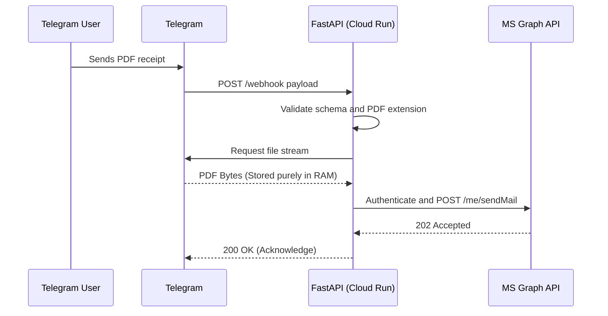

# Architecture Documentation: Condominio Mail Bot

This document covers the decoupled component design, non-blocking operational loops, and structural trade-offs implemented within the system.

## 1. High-Level Architectural Design
The solution is built on top of an event-driven architectural pattern utilizing a serverless deployment pipeline.

### Data Flow (Sequence Diagram)

## 2. Decoupled Component Strategy
The codebase isolates core processing perimeters strictly to prevent cross-contamination across external infrastructure logic layers:

* **`main.py` (Ingress Orchestrator):** Acts purely as a processing bridge. It receives HTTP events and sequentializes operations, abstracting internal logic blocks away from the network ingress framework.
* **`schemas.py` (Perimeter Security):** Utilizes Pydantic v2 schemas to enforce strict structural typings, throwing rapid errors at the reverse proxy boundary if unmapped models hit the engine.
* **`telegram_client.py` (Inbound API Edge):** Encapsulates all interfaces toward the Telegram Bot API. Deals exclusively with file metadata checking and byte-stream generation.
* **`email_service.py` (Outbound Delivery Layer):** Isolates the Microsoft Identity lifecycle. This layer abstracts token generation loops, OAuth token storage mechanisms, and base64 parsing.

## 3. Key Architectural Decisions
* **API REST Handshake over SMTP Relay:** Global identity security standards enforce the complete deprecation of basic authentication workflows for corporate and personal email endpoints. Shifting towards credentialed refresh token architectures via Microsoft Graph guarantees reliable compliance without hardcoded passwords.
* **Stateless Memory Buffer Isolation:** Hard block placed against file writing commands targeting persistent storage blocks or local disk temporary paths inside the Docker layout. Keeping the processing layout entirely in-memory prevents file access privilege bottlenecks, decreases latency, and blocks forensic document leaks if a container environment is compromised.